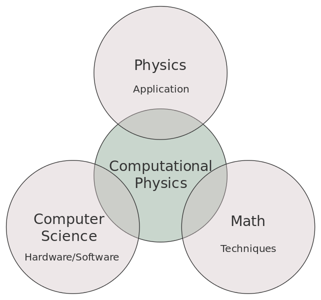

## What is Computational Physics?

Computational physics is an exciting and dynamic field that combines the principles of physics with advanced computational techniques. By leveraging numerical analysis, this discipline enables us to tackle complex problems that are difficult or impossible to solve analytically. It’s a fascinating intersection of physics, computer science, and mathematics.

### Why Computational Physics Matters

The advent of modern computers revolutionized the way we approach scientific problems. Computational physics was one of the first areas to benefit from this technological advancement. Initially, it was primarily used for simulations and modeling, but today, it has evolved into a fundamental component of computational sciences.

While computational physics still plays a crucial role in developing computer simulations of physical systems, its applications extend far beyond that. From understanding intricate physical phenomena to solving real-world problems, computational physics is a powerful tool in the scientific arsenal.

### Essential Background Knowledge

To effectively engage with computational physics, you'll need a solid foundation in several key areas:

- **Root Finding:** Techniques like the Newton-Raphson Method are used to find solutions to equations that cannot be solved algebraically. This is essential for solving non-linear problems.
- **Systems of Linear Equations:** Methods such as LU Decomposition help in solving systems of linear equations, which is fundamental in many computational problems.
- **Ordinary Differential Equations (ODEs):** Techniques like Runge-Kutta Methods are used to solve ODEs, which describe how physical quantities change over time.
- **Integration:** Methods like Monte Carlo Integration are employed to approximate the value of integrals, which is crucial for dealing with complex systems.
- **Partial Differential Equations (PDEs):** The Finite Difference Method is one approach used to solve PDEs, which are key in modeling phenomena that vary over space and time.
- **Matrix Manipulation:** Efficient manipulation of matrices is vital for many numerical methods and simulations.

In summary, computational physics is a vibrant and essential field that uses computational power to explore and solve a wide range of physical problems. Whether you're simulating complex systems or tackling theoretical challenges, the skills and techniques from computational physics are invaluable.
